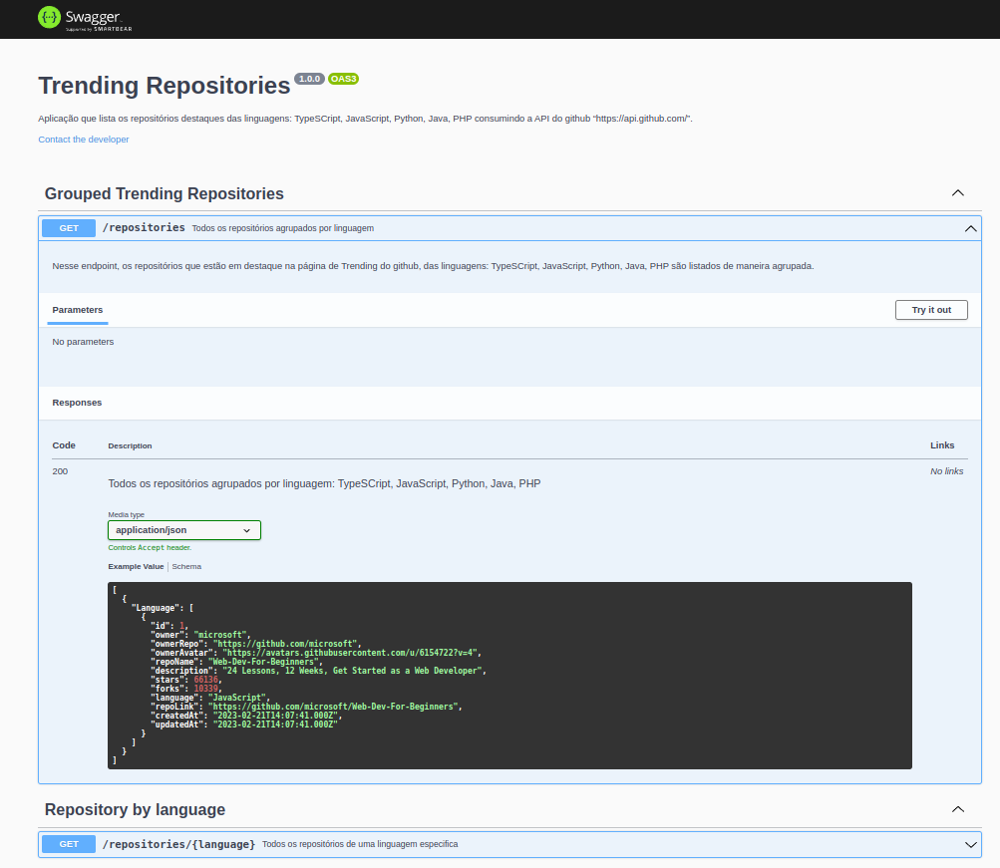

# Trending Repositories

## Descrição

O projeto Trending Repositories é uma aplicação fullstack responsável por coletar, armazenar e listar os repositórios que estão em destaque na página https://github.com/trending , utilizando a API https://api.github.com/.
A aplicação pode ser rodada localmente ou conteinerizada com o docker. O backend foi construído com nodejs, express e sequelize e tem a função de atualizar a cada hora a lista de repositórios que estão em destaque das linguagens: TypeSCript, JavaScript, Python, Java, PHP. O frontend foi construído com react.

## Deploy URL's da aplicação 

### <a href="https://trending-repositories.up.railway.app/">Frontend Live:  https://trending-repositories.up.railway.app</a>

### <a href="https://api-trending-repositories.up.railway.app/repositories">API Live: app/repositories</a>
### <a href="https://api-trending-repositories.up.railway.app/repositories/javascript">API Live: app/repositories/{language}</a>

 

# Instruções para instalação local
## Github `TOKEN`

- Para que a aplicação funcione corretamente, é necessário que o usuário gere um token na aba de Developer Settings no github e salve o mesmo em um `.env` na variável `GITHUB_TOKEN`, dentro do diretório do backend.

 

## Dependencias

Para instalar todas as dependencias (app/backend e app/frontend), dentro da pasta `/app`, rode o comando:

- `npm run install:all`

## Iniciar o banco de dados

Para que a aplicação funcione é necessario iniciar o banco de dados, então rode o comando no ambiente que estiver rodando a aplicação:

- ## Localmente 
Depois que a aplicação estiver configurada (`explicação de como configurar abaixo`) e estiver rodando, se estiver rodando localmente, basta rodar o comando na pasta raiz do projeto:

- app/backend -> `npm run db:init`

- ## Docker 
Depois que subir os container’s e a aplicação estiver rodando com o docker (`explicação de como configurar abaixo`) se estiver tudo certo, é necessário acessar o container, para isso digite:
`docker exec -it app-back-trending-repo sh`, e dentro do terminal do container que sera mostrado digite:

- `npm run db:init`

> Os outros comandos disponíveis também devem ser executados dentro do container, caso esteja rodando com docker.

 

## Para rodar com Docker

Para rodar com o docker, basta definir as variáveis de ambiente e as portas de acordo com a escolha do usuário  (já existe uma configuração generica do compose e config/database.ts, e deve funcionar), dentro do docker-compose no diretório `src/app` e digitar o comando `docker-compose up -d --build` no terminal.

-   Caso de algum conflito de portas com o mysql pare o `mysql` se estiver usando localmente na porta padrão (`3306`), ou adapte, caso queira fazer uso da aplicação em containers
-   Para parar o mysql digite: `systemctl stop mysql`

-   Serão iniciados os containers: `app_backend`, `app_frontend` e `db`  

-   A partir daqui os 3 containers estarão em funcionamento, e aplicação do frontend e backend estão rodando, você pode acessar elas no seu `http://localhost:<PORTA>`.

## Para rodar Localmente

Para rodar localmente, após instalar as dependências, é necessário declarar as variáveis de ambiente no .env e acessar as pastas para rodar os comandos que startam as aplicações.

> /app/backend

 - `npm run dev`

> /app/frontend

-  `npm run dev`

 

# Comandos do `Backend` 

> Comando para iniciar o banco de dados e as tabelas

- `npm run db:init`

 > Comando onde a DB é dropada, reinicializada e alimentada de acordo com as migrations e seeds que estão em src/database.

- `npm run db:reset`

>  Comando para iniciar o servidor com o nodemon.

-  `npm run dev`

> Esse comando executa o teste automático de todas as camadas da aplicação.

-  `npm run test`

>  Esse comando executa o teste de cobertura da aplicação

 - `npm run test:coverage`

# Comandos do `Frontend`

>  Esse comando inicia a aplicação localmente.
 
- `npm run dev`

# Comandos do `app`

>  Esse comando mostra os logs dos conteiners que estão rodando.
 
- `npm run logs`

 

# SwagerUI

Para facilitar o entendimento do funcionamento de todos os endpoints e a dinâmica entre eles, essa API conta com um painel do SwagerUI, que demonstra cada endpoint e expõe a sua funcionalidade.

 
 

  
Exemplo

  

 

<a href="https://swagger.io/">Link do Swagger</a>

Endpoints:

-   get: /repositories
-   get: /repositories/{language}

Para ter acesso a descrição detalhada de cada um, após rodar o projeto acesse:
 

> ### localhost+`PORTA`+/documentation/.

  

Por padrão o projeto está rodando na porta 3001.

> ### http://localhost:3001/documentation/

